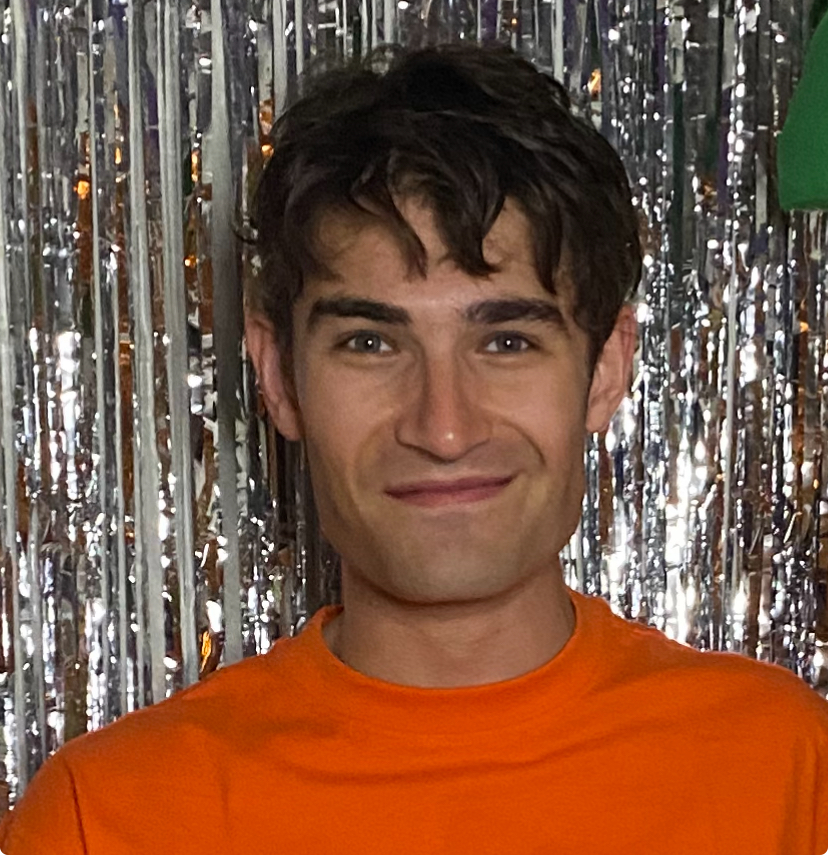

## about ##
I'm a PhD candidate in Linguistics at the University of Chicago. My research interests are in semantics and pragmatics, and I'm currently writing my dissertation on negative answers to wh-questions. I'm a member of the [Language Processing Lab](https://lucian.uchicago.edu/blogs/lpl/). 

Here's my [Google Scholar](https://scholar.google.com/citations?user=W3f-kgsAAAAJ&hl=en&oi=ao) profile.

lfagen AT uchicago DOT edu
